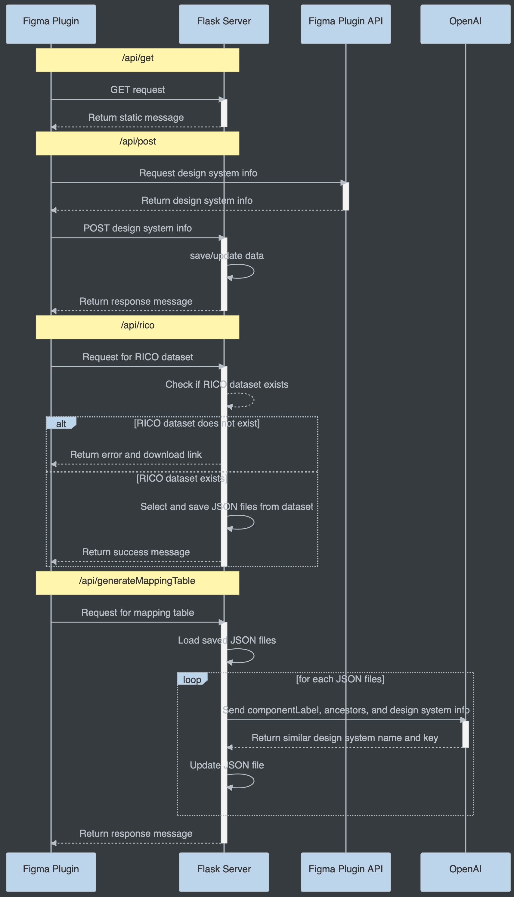

# Figma Explorer Plugin

This Figma plugin allows users to explore and analyze Figma designs using AI-powered insights.

## Features

- Initialize plugin with a Figma URL
- Start and stop design exploration
- Define custom tasks and personas for exploration
- Real-time status updates
- Automatic report generation and visualization in Figma

## Quick Start

1. Install dependencies: `yarn`

2. In Figma, go to `Plugins` -> `Development` -> `Import plugin from manifest...` and select the `manifest.json` file from this repository.

3. Run the plugin in Figma to start exploring your designs.

## How It Works

1. **Initialization**: Enter a Figma URL to connect the plugin to your design file.

2. **Exploration**: Provide a task description and persona description to start the AI-powered exploration.

3. **Real-time Updates**: The plugin polls the server for updates every 10 seconds, visualizing the exploration progress directly in your Figma file.

4. **Report Generation**: As the exploration progresses, the plugin creates and updates frames in Figma to display the findings.

## System Architecture

Below is a UML sequence diagram illustrating the interaction between the Figma Plugin, Flask Server, Figma Plugin API, and OpenAI:

<!-- 
<pre>
@startuml
participant User
participant "self_explorer_figma.py" as Main
participant "Chrome API" as SeleniumController
participant "Figma Rest API" as FigmaAPI
participant "File Cache" as FileCache
participant "Language Model" as LanguageModel

User -> Main: Run script with --url, --task_desc, --persona_desc
activate Main

Main -> FigmaAPI: Get Figma file data
activate FigmaAPI
FigmaAPI -> Main: File data
deactivate FigmaAPI

Main -> FileCache: Save file data as JSON
activate FileCache
FileCache -> Main: File data saved
deactivate FileCache

Main -> SeleniumController: Create SeleniumController object
activate SeleniumController
SeleniumController -> Main: SeleniumController instance
deactivate SeleniumController

Main -> SeleniumController: Open Chrome and navigate to URL
activate SeleniumController
SeleniumController -> Main: Browser opened and navigated
deactivate SeleniumController

Main -> Main: Print task description

Main -> Main: Print persona description (if provided)

loop until task_complete or max_rounds reached
  Main -> SeleniumController: Take screenshot before action
  activate SeleniumController

  SeleniumController -> Main: Screenshot before action
  deactivate SeleniumController

  Main -> FileCache: Get current node data from saved JSON
  activate FileCache
  FileCache -> Main: Node data
  deactivate FileCache

  Main -> Main: Create list of UI elements

  Main -> Main: Draw bounding boxes on screenshot

  Main -> LanguageModel: Get model response for exploration
  activate LanguageModel
  LanguageModel -> Main: Model response
  deactivate LanguageModel

  Main -> Main: Parse exploration response

  alt act_name in ["tap", "long_press", "swipe"]
    Main -> SeleniumController: Perform action (tap, long_press, or swipe)
    activate SeleniumController
    SeleniumController -> Main: Action performed
    deactivate SeleniumController
  else
    Main -> Main: Break loop
  end

  Main -> SeleniumController: Take screenshot after action
  activate SeleniumController
  SeleniumController -> Main: Screenshot after action
  deactivate SeleniumController

  Main -> LanguageModel: Get model response for reflection
  activate LanguageModel
  LanguageModel -> Main: Model response
  deactivate LanguageModel

  Main -> Main: Parse reflection response

  alt decision in ["BACK", "CONTINUE", "SUCCESS"]
    Main -> Main: Generate and save documentation
  else
    Main -> Main: Handle error or ineffective action
  end
end

Main -> User: Print exploration result and generated docs count
@enduml
</pre>
-->

## Plugin Structure

- `src/plugin/controller.ts`: Handles communication between Figma and the server, manages report polling, and creates Figma elements.
- `src/app/components/App.tsx`: Defines the plugin's user interface using React and Material-UI components.

## Note

This plugin requires a separate server component to function. Ensure the server is running and accessible at `http://localhost:5000` before using the plugin.

