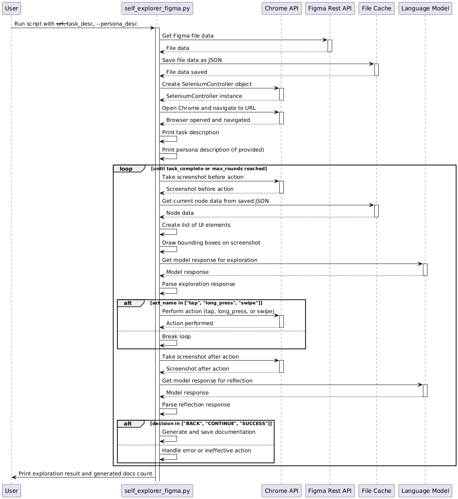

# Figma Plugin with Flask Backend

이 플러그인은 Figma와 함께 Flask 기반의 백엔드를 사용하는 방법을 설명합니다.

## 빠른 시작

### 1. 클라이언트 사이드 설정

클라이언트 사이드는 Figma 플러그인을 통해 구현됩니다.

1. `yarn` 명령을 실행하여 프로젝트의 종속성을 설치합니다.
2. Figma에서 `Plugins` -> `Development` -> `Import plugin from manifest...`를 선택하고 이 레포지토리의 `manifest.json` 파일을 선택합니다.

플러그인의 UI를 변경하려면 [App.tsx](./src/app/components/App.tsx) 파일을 편집하고, Figma API와 상호작용하려면 [controller.ts](./src/plugin/controller.ts) 파일을 편집하세요. 더 자세한 정보는 [Figma API Overview](https://www.figma.com/plugin-docs/api/api-overview/)를 참조하세요.

### 2. 백엔드 설정

먼저, 필요한 패키지를 설치합니다. 이 프로젝트는 Python 3.6 이상에서 작동하며, 가상 환경에서 실행하는 것이 좋습니다.

```bash
pip install -r requirements.txt
```

### 3. Flask 서버 작성 및 실행

백엔드 서버를 실행하기 전에 `src/server` 디렉토리로 이동해야 합니다.

```bash
cd src/server
```

그런 다음, `app.py` 파일에서 Flask 웹서버를 작성하고 실행합니다. 
예시로 이 저장소에서는 `app.py`을 제공합니다. 해당 파일에는 Flask 애플리케이션을 설정하고 여러 엔드포인트를 정의하는 코드가 포함되어 있습니다.

서버를 실행하려면, 아래의 명령어를 사용하세요:

```bash
python app.py
```

## 동작 방식

Figma 플러그인과 Flask 서버는 아래와 같이 정보를 주고 받습니다. 


```
sequenceDiagram
    participant Plugin as Figma Plugin
    participant Server as Flask Server
    participant Figma as Figma Plugin API
    participant GPT as OpenAI

    Note over Plugin,Server: /api/get
    Plugin ->> Server: GET request
    activate Server
    Server -->> Plugin: Return static message
    deactivate Server

    Note over Plugin,Server: /api/post
    Plugin ->> Figma: Request design system info
    activate Figma
    Figma -->> Plugin: Return design system info
    deactivate Figma
    Plugin ->> Server: POST design system info
    activate Server
    Server ->> Server: save/update data
    Server -->> Plugin: Return response message
    deactivate Server


    Note over Plugin,Server: /api/rico
    Plugin ->> Server: Request for RICO dataset
    activate Server
    Server -->> Server: Check if RICO dataset exists
    alt RICO dataset does not exist
        Server -->> Plugin: Return error and download link
    else RICO dataset exists
        Server ->> Server: Select and save JSON files from dataset
        Server -->> Plugin: Return success message
    end
    deactivate Server

    Note over Plugin,Server: /api/generateMappingTable
    Plugin ->> Server: Request for mapping table
    activate Server
    Server ->> Server: Load saved JSON files
    loop for each JSON files
        Server ->> GPT: Send componentLabel, ancestors, and design system info
        activate GPT
        GPT -->> Server: Return similar design system name and key
        deactivate GPT
        Server ->> Server: Update JSON file
    end
    Server -->> Plugin: Return response message
    deactivate Server
```